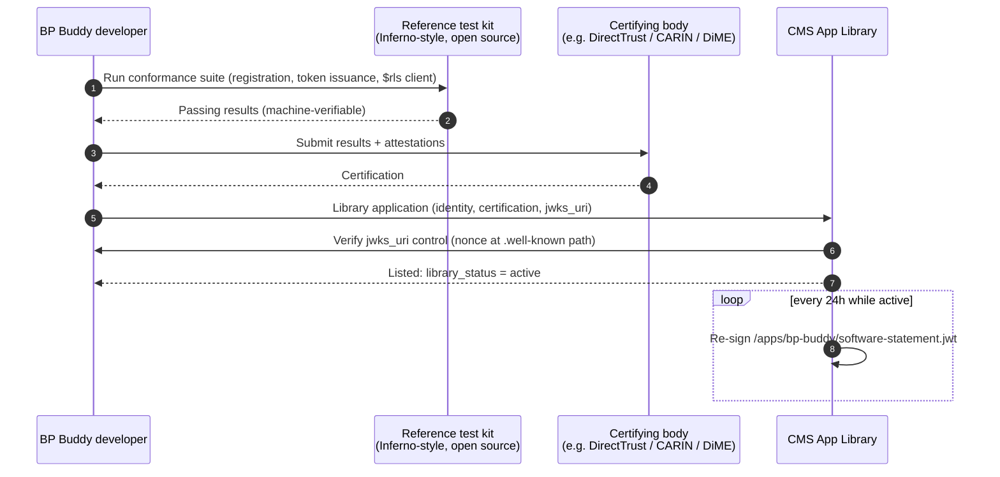
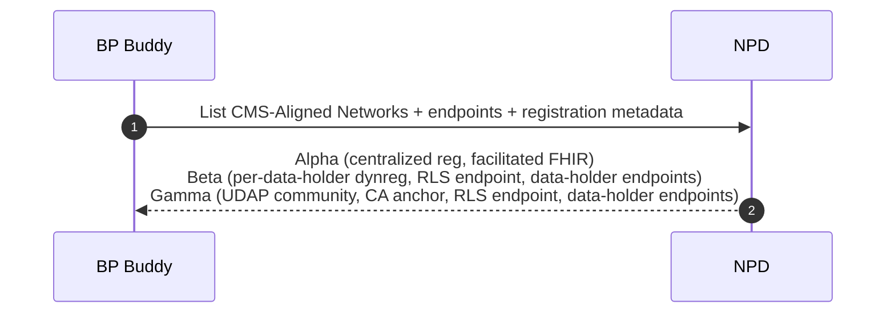
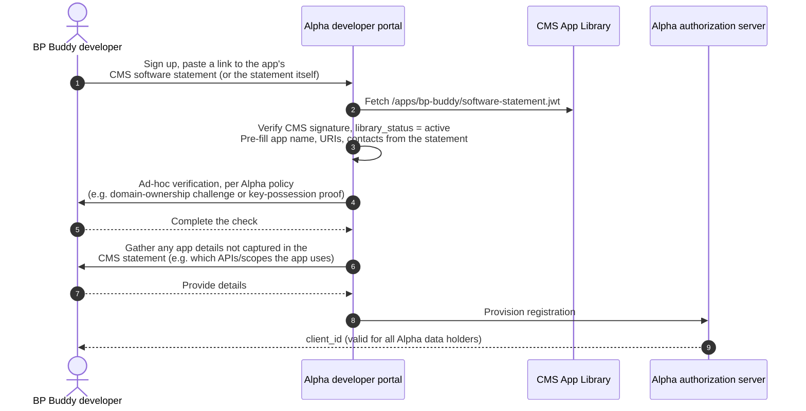
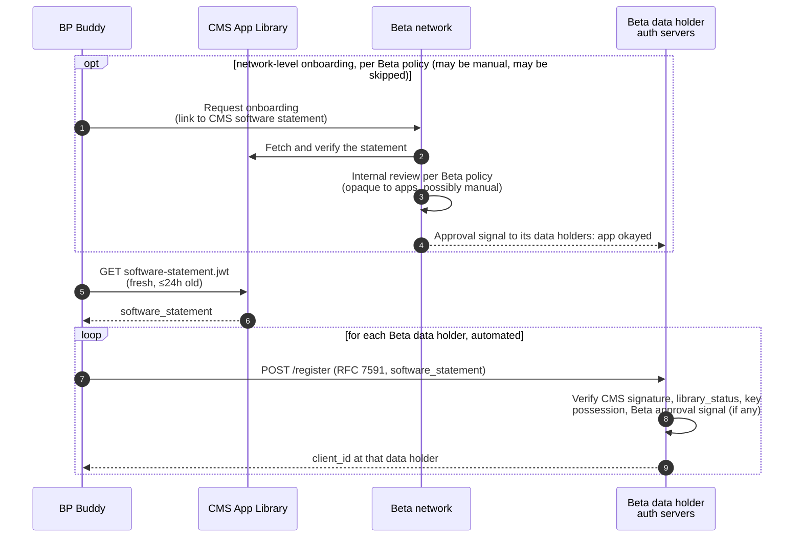
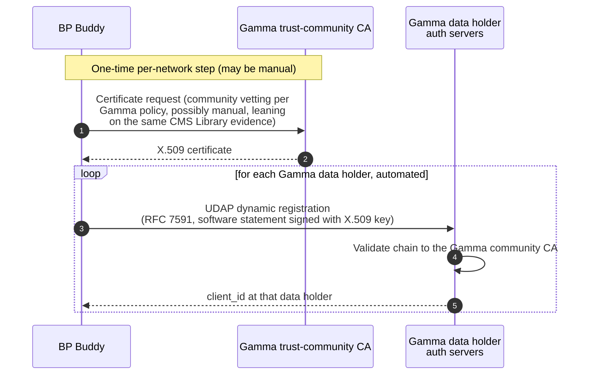
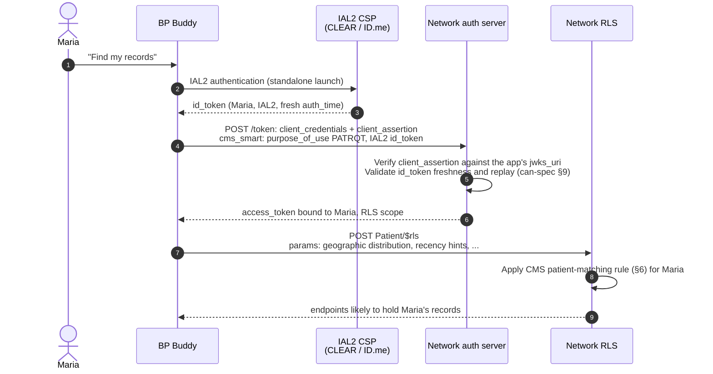
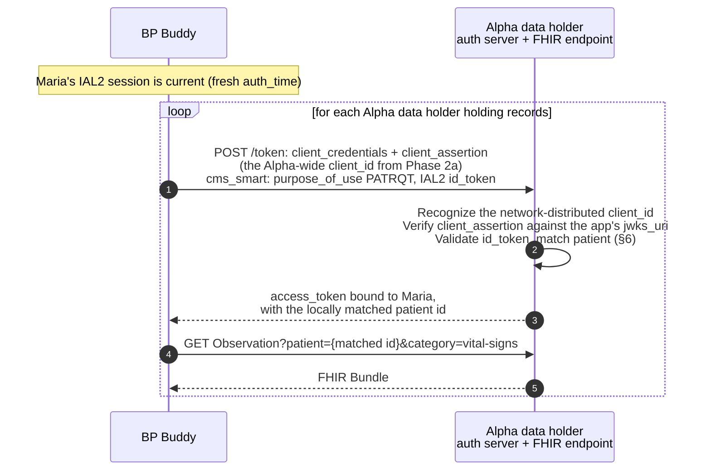
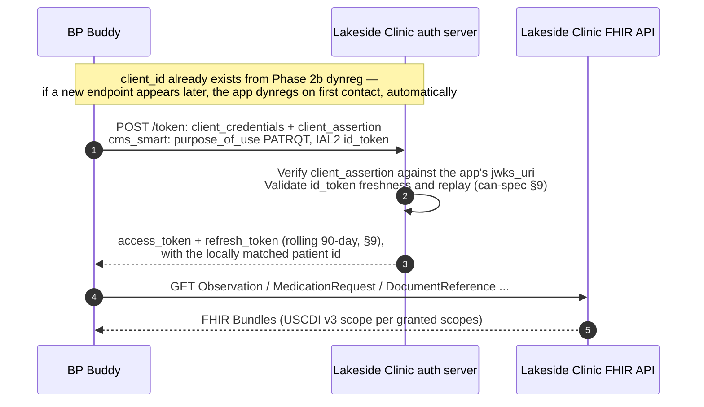
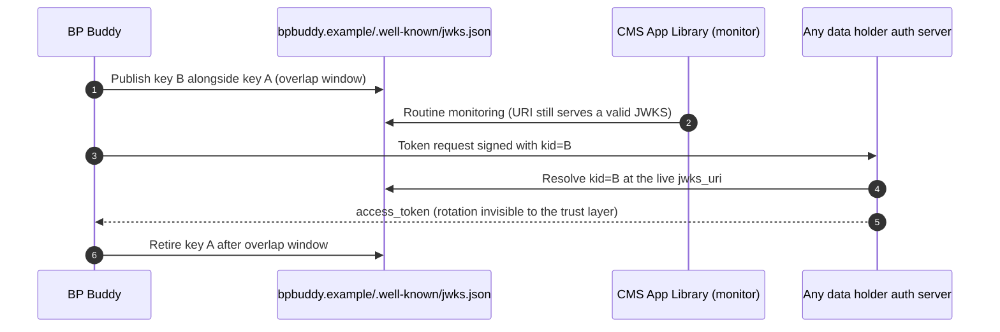

# An App's Life Across CMS-Aligned Networks, Without a Home Network

**Flow walkthrough with sequence diagrams**
*Companion to [apps-without-home-networks.md](apps-without-home-networks.md). Shows that a patient-facing app, carrying only its CMS App Library credentials, can register with networks that work in three different ways, locate records, and retrieve data, with no home network and no manual per-data-holder steps. Nothing in these flows changes if a home network exists; none of the mechanics requires one.*

> **Conventions**
>
> - **Record location** uses a placeholder **`$rls`** FHIR operation throughout.
>   - *Input:* patient identity context.
>   - *Output:* a list of data-holder endpoints likely to hold records.
>   - The real wire profile is an open question (can-spec Appendix A1); nothing here depends on its exact shape.
> - **Registration** uses [RFC 7591 Dynamic Client Registration](https://www.rfc-editor.org/rfc/rfc7591) as the shared wire format wherever dynamic registration appears; the *software statement* presented varies by trust path.
> - **Identity**, per CMS HTE requirements: every token request that leads to RLS or data queries carries IAL2 identity evidence, and the resulting access token is bound to that verified patient.
> - **Token requests** follow the [Blue Button CMS Aligned Networks pattern](https://bluebutton.cms.gov/cms-aligned-networks-documentation/): `client_credentials` grant with an asymmetric `client_assertion`, carrying a `cms_smart` extension whose claims include `purpose_of_use` (`PATRQT` for patient access) and the CSP-issued IAL2 `id_token`. This shape is used for concreteness because CMS has documented it, not because the architecture depends on it: an authorization-code flow, or a flow built on permission tickets, satisfies the same requirement. What the requirement actually is: some automated way for the app to authenticate to each data holder's token endpoint, with the patient's identity evidence flowing through to the data holder so it can apply its own matching and policy. A network may help mint or relay credentials, but issuing access tokens for its data holders' APIs implies policy decisions that belong to the edge nodes.

---

## Cast

| Actor | Role |
|---|---|
| **BP Buddy** | Patient-facing app, listed in the Medicare App Library. Holds its own keys at `https://bpbuddy.example/.well-known/jwks.json`. |
| **CMS App Library** | Publishes BP Buddy's listing and a short-lived [CMS-signed software statement](https://www.linkedin.com/pulse/software-statements-medicare-app-library-josh-mandel-md/) at `/app-library/apps/bp-buddy/software-statement.jwt`. |
| **NPD** | National Provider Directory: networks, endpoints, trust-anchor metadata. |
| **Alpha Health Network** | Offers **centralized registration through a developer portal**: a few manual steps, then one client ID good for the whole network; apps query each Alpha data holder's FHIR endpoint directly (the "Epic model"). |
| **Beta Exchange** | Offers **CMS-software-statement dynamic registration** directly at each of its data holders' authorization servers; Beta itself runs the RLS and publishes endpoints. |
| **Gamma Trust Network** | A **UDAP trust community**: one-time per-network credentialing with Gamma's recognized CA, then UDAP dynamic registration at each data holder. Gamma runs its own RLS endpoint. |
| **Maria** | A patient, IAL2-verified through a CMS-approved credential service provider (CSP). |

The three networks use three different registration styles, and the walkthrough demonstrates one invariant:

> **Per-network custom work is acceptable. Per-data-holder manual work is not.**

---

## Phase 0 — One-time setup at the CMS App Library

BP Buddy's developer goes through CMS App Library admission once: identity verification, FHIR R4 / SMART on FHIR conformance against the open reference test kit, certification by a recognized vetting body, and a `jwks_uri` control check. From then on, CMS re-issues a short-lived signed software statement for as long as the app is in good standing (`library_status: active`).

*Example artifacts: [fetching the CMS-signed software statement, with the decoded JWT](example-artifacts/phase0-software-statement.md).*

No network appears in this diagram: the trust decision is made once, by CMS.

---

## Phase 1 — Discovery: what networks exist, and how does each one work?

*Example artifacts: [the NPD request and network listing](example-artifacts/phase1-npd-discovery.md).*

NPD tells the app (or the client library it uses) how each network handles registration, as machine-readable metadata.

---

## Phase 2 — Registering with each network

Any of the three networks may put a human in the loop at the network level. Alpha's portal makes this visible, but Beta's and Gamma's data holders may equally look for a signal from their own network that an app is okay to let in, and the network behind that signal may have run a manual review. All of this is conformant, because whatever manual steps exist attach to the **network**, once; the app's interaction with each **data holder** stays automatic.

Each network documents its own registration method, and all of them are allowed so long as the method works uniformly across that network's data holders. Over time the ecosystem should converge on a small number of patterns rather than thirty, but that convergence needs real industry experience first; the requirement worth holding now is that access scales within each network.

### 2a. Alpha — centralized registration via a developer portal (one client ID for the whole network)

Alpha runs a developer portal, and registering involves a human:

*Example artifacts: [the statement link, a key-possession proof JWT, and the provisioned client_id](example-artifacts/phase2a-alpha-portal.md).*

These manual steps are acceptable because they happen once per network; the invariant only forbids manual work per data holder. The CMS statement still does its job: the portal pre-fills its form from a signed artifact and verifies one signature instead of re-vetting the app. The details of the ad-hoc verification are Alpha's business; this walkthrough deliberately leaves them unspecified, and the spec should too.

One registration covers every Alpha data holder participating in the CMS-Aligned exchange; the network absorbs the edge complexity as part of its product.

### 2b. Beta — dynamic registration at each data holder, CMS statement as the trust signal

*Example artifacts: [the RFC 7591 request and response at a Beta data holder](example-artifacts/phase2b-beta-dynreg.md).*

Each registration is a machine-to-machine call that a client library performs in a loop, so the larger count compared to Alpha costs nothing manual. The optional block is where Beta's own judgment lives: it may onboard apps before its data holders accept them, with as much manual review as its policy requires, or it may skip that layer and let the CMS statement carry the decision. Either way, its data holders act on the signal automatically, and the app sees at most one review per network.

### 2c. Gamma — UDAP trust community

*Example artifacts: [the UDAP software statement with its x5c certificate chain](example-artifacts/phase2c-gamma-udap.md).*

Gamma chose a CA-anchored trust path. The app does one custom per-network step (obtaining the certificate), and the per-data-holder layer is automated from there. This satisfies the invariant, and Gamma competes on whether the extra step is worth what its network offers.

Gamma comes closest to working without a separate network-level review, but it would be a mistake to expect UDAP to resolve the underlying policy questions: who may join the trust community, on what terms, and what happens when an app misbehaves. Certificate issuance is itself Gamma's network-level review and can be as manual as its policy requires, and Gamma's data holders may still consult a network-level approval signal before honoring a registration, just as Beta's do.

All three styles consume the same CMS-signed artifact: Alpha's portal pre-fills its form from it, Beta's data holders accept it at an RFC 7591 endpoint, and Gamma's trust community can rely on the same evidence when issuing certificates. The receiving side routes signature validation by issuer (CMS JWKS for CMS statements, the community CA chain for UDAP), as can-spec §7.1 describes. No network ever needed to ask which home network the app belongs to; the federal credential answered the trust question.

---

## Phase 3 — Record location: where does Maria have data?

Maria connects BP Buddy to "find my records." She verifies her identity once via an IAL2 CSP. In line with CMS HTE requirements, **every token request that leads to RLS or data queries carries IAL2 identity evidence**, so the access token the app receives is bound to Maria and can only be used to locate her records. (Patient matching is the CMS-approved rule, can-spec §6; the `$rls` shape is a placeholder, Appendix A1.)

The pattern, identical at each network:

*Example artifacts: [the IAL2 id_token, cms_smart client_assertion, token response, and $rls exchange](example-artifacts/phase3-rls.md).*

The app repeats this flow at Alpha, Beta, and Gamma. The only difference between them is which client credential the network recognized at registration:

| Network | `$rls` result for Maria |
|---|---|
| Alpha | General Hospital |
| Beta | Lakeside Clinic, County Health |
| Gamma | Riverbend Medical |

Purpose of use (`PATRQT`) is declared at the token request and travels with every downstream call (can-spec §10.3). The network's authorization server here protects the network's own RLS API; tokens for data-holder APIs come from the data holders themselves (Phase 4).

**Why an operation rather than a payload?** A simpler placeholder would skip `$rls` entirely and return the record-location results inside the token response itself. That works, but an operation lets the app pass parameters (geographic distribution, recency or date-range hints, resource-type interests) and re-query under the same patient-bound token as its needs change, without repeating the identity flow.

**A natural evolution: permission tickets.** The `$rls` shape above returns locations and leaves the app to run the identity ceremony again per site. An alternative under active exploration ([SMART Permission Tickets, proposal 003](https://build.fhir.org/ig/jmandel/smart-permission-tickets-wip/proposal-003-smart-launch-issuance.html)) folds these together: the patient authorizes once at an issuer through a standard SMART App Launch code flow, and the token response carries signed permission tickets plus endpoint hints. The app redeems a ticket at each data holder's token endpoint via RFC 8693 token exchange; the data holder verifies the ticket signature, independently verifies the identity evidence embedded in it, performs its own patient match, and returns its own access token along with the matched patient id, so no separate `$match` step exists. The issuance ceremony is also the natural place for the patient to choose which locations the app learns about at all: the issuer filters both the endpoint hints and the tickets' data-holder scope to the patient's selections. Either shape satisfies the requirement stated in the Conventions: automated authentication to each data holder's token endpoint, identity evidence flowing through, and tokens issued at the edge. See a [signed example ticket](example-artifacts/permission-ticket-alternative.md).

---

## Phase 4 — Retrieving data

In all three networks the app queries each data holder's FHIR endpoint directly, and each data holder's own authorization server issues the access token after seeing the patient's identity evidence itself. Centralizing token issuance at the network would imply policy decisions (patient matching, scopes, sensitivity handling) that belong to the edge node. What the flavors differ in is how the client_id presented at the data holder was established: Alpha distributed one network-wide client_id at portal registration; Beta and Gamma data holders each issued their own at dynamic registration.

### 4a. Alpha: one network-wide client_id, tokens from each data holder

Alpha distributed the client_id; it does not issue access tokens. The app presents its Alpha-wide client_id, with Maria's identity evidence, at each data holder's own token endpoint:

*Example artifacts: [the token request at a data holder using the Alpha-wide client_id](example-artifacts/phase4a-alpha-facilitated.md).*

### 4b. Beta and Gamma: per-data-holder client_ids, tokens from each data holder

*Example artifacts: [the Lakeside token request, refresh_token, and FHIR query](example-artifacts/phase4b-federated.md).*

The Gamma flow is identical from here; the UDAP-vs-CMS-statement difference was consumed at registration time. Runtime is the same everywhere: a `client_credentials` grant with an asymmetric `client_assertion` (its `kid` resolvable at the app's `jwks_uri`), a `cms_smart` extension carrying the IAL2 `id_token`, and a patient-bound access token issued by the data holder. The only thing that varies is where the client_id came from.

On refresh: data holders may issue refresh tokens under the rolling 90-day window of can-spec §9, as 4b shows. In the permission-ticket model described under Phase 3, a still-valid ticket is itself the continuation credential: the app re-presents it for a fresh access token, and renews the tickets at the issuer when they expire.

---

## Phase 5 — Key rotation

The app's authoritative key material lives at its CMS-verified `jwks_uri`, and the app rotates keys there on its own schedule, with no CMS involvement. Each trust path has to absorb rotation without reintroducing manual per-network steps.

**CMS-statement paths (Alpha, Beta): rotation is free**, because the statement binds the URI rather than any particular key. Data holders resolve the app's current keys at token time via `kid` lookup against the live JWKS. The app publishes the new key alongside the old for a standard overlap window, starts signing with the new `kid`, and retires the old one. There is nothing to re-issue and nobody to notify.

*Example artifacts: [the JWKS before and during overlap, and a client_assertion signed with the new key](example-artifacts/phase5-key-rotation.md).*

**Network-issued certificate paths (Gamma) need a rule here**, because an X.509 certificate binds a specific key. Once the app rotates, every certificate a network CA has issued is out of date, and if re-syncing means emailing the CA, rotation has become a manual per-network step.

The requirement to write down:

> Any network- or community-issued credential **MUST** remain automatically synchronized with the app's published `jwks_uri`. Issuance and re-issuance MUST be automatable end-to-end; key rotation MUST NOT require manual steps at any network or data holder.

Approaches that could satisfy this include short-lived certificates minted against the current contents of the `jwks_uri`, CA-side monitoring with automatic re-issuance, or app-triggered re-issuance authenticated with a key that has not yet been retired. Which of these a community offers is its own business; the rule is the only part worth standardizing.

The general principle: **the `jwks_uri` is the single source of truth for the app's keys, and every other credential format is a derived, auto-refreshing view of it.** A network is free to issue certificates at registration time in whatever flavor its community prefers, so long as those certificates track the JWKS automatically for the life of the registration.

---

## Summary

| | Alpha (centralized) | Beta (CMS-statement dynreg) | Gamma (UDAP) |
|---|---|---|---|
| Per-network step (may be manual) | portal signup: paste statement link, ad-hoc check | optional network-level approval, invisible to the app | community cert issuance per Gamma policy |
| Per-data-holder registrations | 0 (one network-wide client_id) | N, all automated | N, all automated |
| Per-data-holder **manual** steps | **0** | **0** | **0** |
| Trust signal verified | CMS statement | CMS statement | X.509 chain → NPD anchor |
| Runtime auth | client_credentials + cms_smart (IAL2 id_token) | same | same |

Throughout the walkthrough, BP Buddy never:

- designated a home network or asked any network to vouch for it;
- emailed a JWKS URL or touched a portal per data holder (Alpha's portal was one signup for the whole network);
- paid a per-network access fee;
- coordinated a key rotation by hand (every credential tracked its `jwks_uri` automatically);
- repeated its vetting (the CMS Library review happened once and traveled as a signed artifact).

A developer who doesn't want to do even this much can hand Phases 1–4 to a platform or an open-source library, or can skip connectivity entirely and receive Maria's data when she chooses to share it from an app that does connect.
