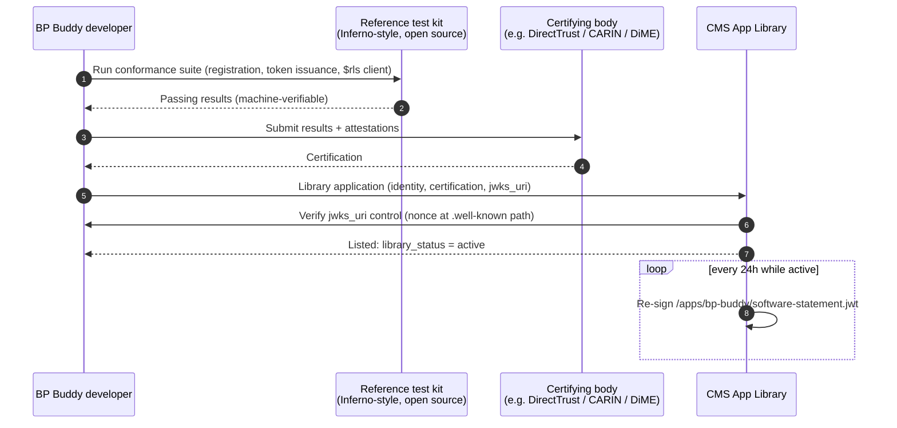
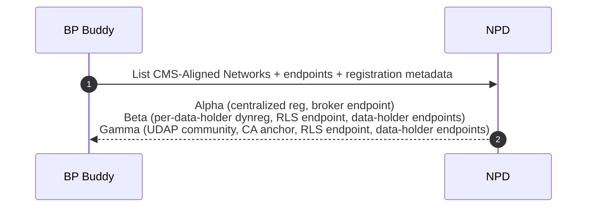
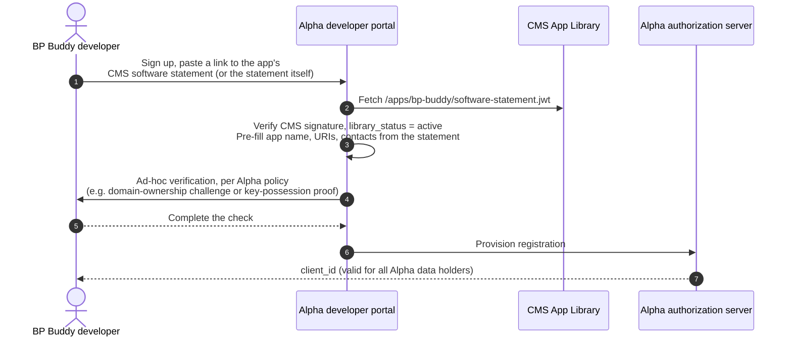
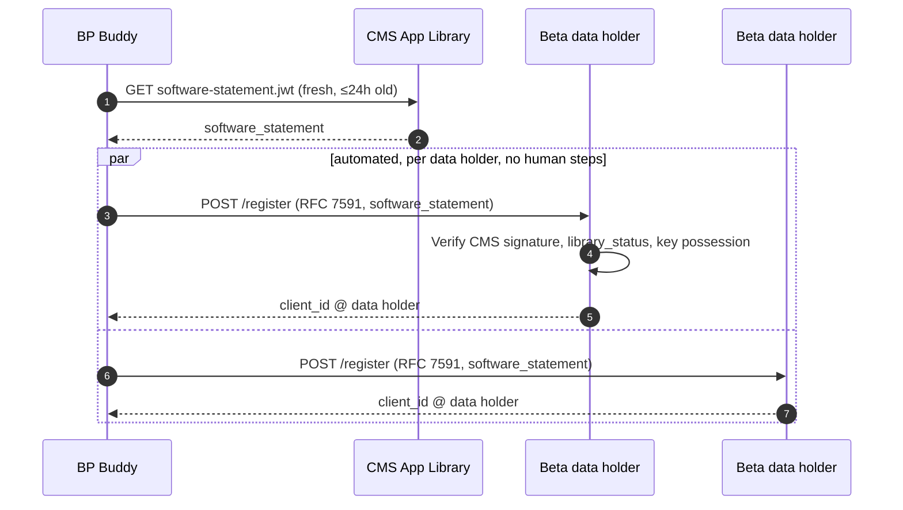
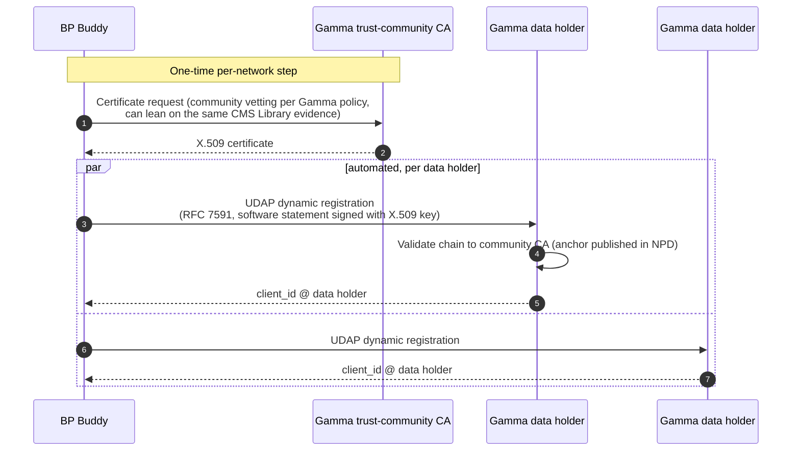
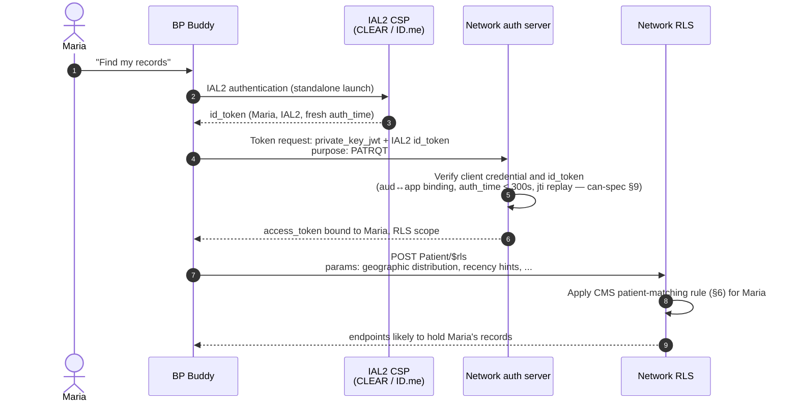
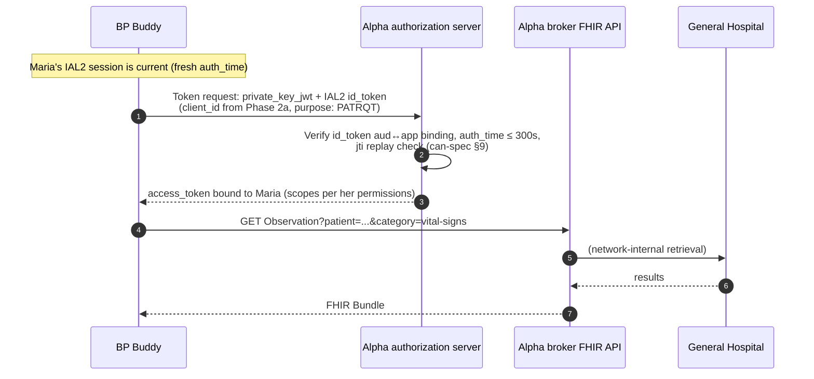
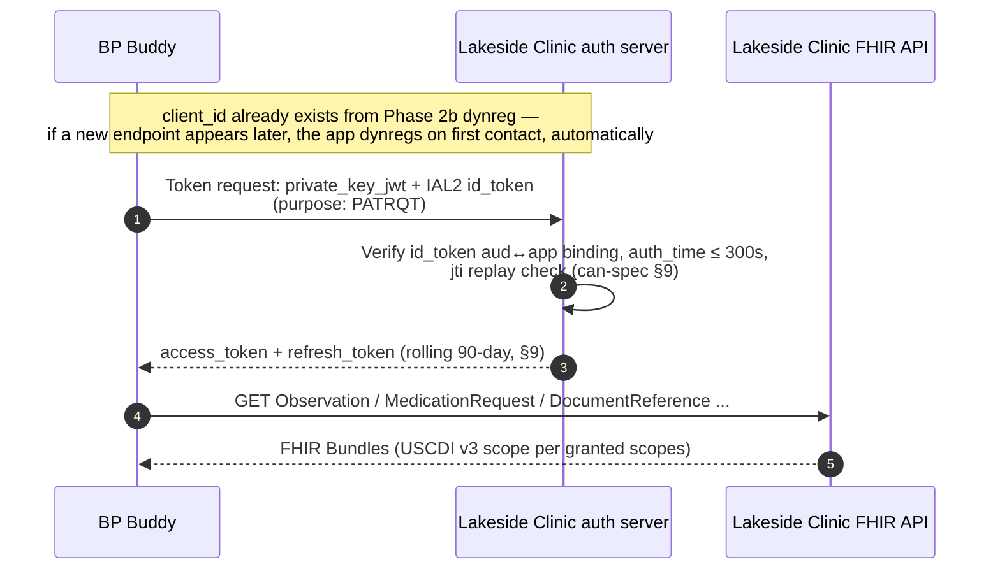
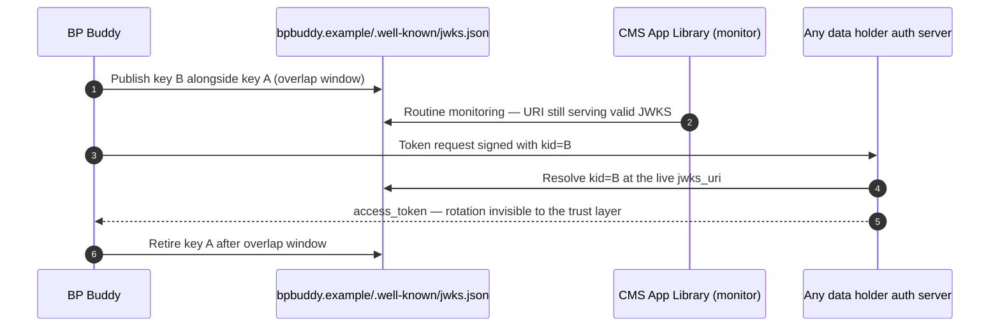
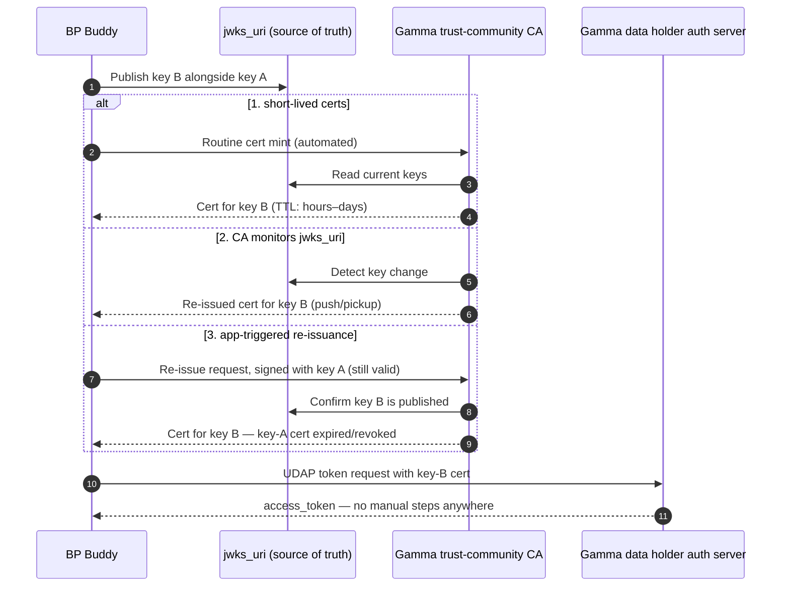

# An App's Life Across CMS-Aligned Networks — Without a Home Network

**Flow walkthrough with sequence diagrams**
*Companion to [apps-without-home-networks.md](apps-without-home-networks.md). Shows that a patient-facing app, carrying only its CMS App Library credentials, can register with networks that work in three different ways, locate records, and retrieve data — with no home network and no manual per-data-holder steps.*

> **Conventions**
>
> - **Record location** uses a placeholder **`$rls`** FHIR operation throughout.
>   - *Input:* patient identity context.
>   - *Output:* a list of data-holder endpoints likely to hold records.
>   - The real wire profile is an open question (can-spec Appendix A1); nothing here depends on its exact shape.
> - **Registration** uses [RFC 7591 Dynamic Client Registration](https://www.rfc-editor.org/rfc/rfc7591) as the shared wire format wherever dynamic registration appears; the *software statement* presented varies by trust path.
> - **Identity**, per CMS HTE requirements: every token request that leads to RLS or data queries carries IAL2 identity evidence, and the resulting access token is bound to that verified patient.

---

## Cast

| Actor | Role |
|---|---|
| **BP Buddy** | Patient-facing app, listed in the Medicare App Library. Holds its own keys at `https://bpbuddy.example/.well-known/jwks.json`. |
| **CMS App Library** | Publishes BP Buddy's listing and a short-lived [CMS-signed software statement](https://www.linkedin.com/pulse/software-statements-medicare-app-library-josh-mandel-md/) at `/app-library/apps/bp-buddy/software-statement.jwt`. |
| **NPD** | National Provider Directory: networks, endpoints, trust-anchor metadata. |
| **Alpha Health Network** | Offers **centralized registration through a developer portal**: a few manual steps, then one client ID good for the whole network; Alpha handles connectivity to its edge data holders (the "Epic model"). |
| **Beta Exchange** | Offers **CMS-software-statement dynamic registration** directly at each of its data holders' authorization servers; Beta itself runs the RLS and publishes endpoints. |
| **Gamma Trust Network** | A **UDAP trust community**: one-time per-network credentialing with Gamma's recognized CA, then UDAP dynamic registration at each data holder. |
| **Maria** | A patient, IAL2-verified through a CMS-approved credential service provider (CSP). |

Three networks, three registration styles. The invariant being demonstrated:

> **Per-network custom work is acceptable. Per-data-holder manual work is not.**

---

## Phase 0 — One-time setup: the app's only "onboarding," anywhere

BP Buddy's developer goes through CMS App Library admission once: identity verification, FHIR R4 / SMART on FHIR conformance against the open reference test kit, certification by a recognized vetting body, and a `jwks_uri` control check. From then on, CMS re-issues a short-lived signed software statement for as long as the app is in good standing — `library_status: active`.

No network appears in this diagram: the trust decision is made once, by CMS.

---

## Phase 1 — Discovery: what networks exist, and how does each one work?

NPD tells the app (or the open-source library it uses) which door each network offers. The per-network variation is mechanical metadata, not relationship-building.

---

## Phase 2 — Registering with each network

The three networks span an automation spectrum: Alpha's portal involves a human and a few manual steps; Beta's dynamic registration involves neither. Both are conformant, because the manual steps are **per network** — bounded, one-time — never per data holder.

### 2a. Alpha — centralized registration via a developer portal (one client ID for the whole network)

Alpha runs a developer portal, and registering involves a human:

Manual steps, and that is fine: they happen once, per network, and the invariant only forbids manual work per data holder. The CMS statement still does its job here — the portal pre-fills its form from a signed artifact and verifies one signature instead of re-vetting the app. What the ad-hoc verification looks like is Alpha's business; this walkthrough deliberately doesn't specify it, and neither should the spec.

One registration covers every data holder on Alpha — the network absorbed the edge complexity as part of its product.

### 2b. Beta — dynamic registration at each data holder, CMS statement as the trust signal

More registrations than Alpha — but every one is a machine-to-machine call a library performs in a loop. Per-data-holder *work*, zero per-data-holder *manual steps*.

### 2c. Gamma — UDAP trust community

Gamma chose a CA-anchored trust path. The app does one custom per-network step (getting the cert), then the per-data-holder layer is automated again. Acceptable under the invariant — and Gamma competes on whether that extra step is worth what its network offers.

> Three doors, one artifact: a portal pre-fills its manual form from the statement (Alpha), an RFC 7591 endpoint accepts it directly (Beta), a trust community issues against the same evidence (Gamma). The receiving side routes signature validation by issuer — CMS JWKS for CMS statements, community CA chain for UDAP — exactly as can-spec §7.1 describes. Nowhere did any network ask "who is your home network?", because nobody needed one to decide whether to trust the app.

---

## Phase 3 — Record location: where does Maria have data?

Maria connects BP Buddy to "find my records." She verifies her identity once via an IAL2 CSP. In line with CMS HTE requirements, **every token request that leads to RLS or data queries carries IAL2 identity evidence** — so the access token the app receives is *bound to Maria*. The app can then call `$rls` only for the patient who authenticated; there is no token that locates anyone else's records. (Patient matching is the CMS-approved rule, can-spec §6; the `$rls` shape is a placeholder, Appendix A1.)

The pattern, identical at each network:

Run identically against all three networks — the only variation is which client credential each network recognized at registration:

| Network | `$rls` result for Maria |
|---|---|
| Alpha | General Hospital |
| Beta | Lakeside Clinic, County Health |
| Gamma | Riverbend Medical |

Purpose of use (`PATRQT`) is declared at the token request and travels with every downstream call (can-spec §10.3).

**Why an operation rather than a payload?** The maximal-placeholder alternative is to skip `$rls` entirely and return the record-location results *inside the token response* itself. That works, but a real operation earns its place: the app can pass parameters — geographic distribution, recency or date-range hints, resource-type interests — and can re-query under the same patient-bound token as its needs evolve, without another round of identity ceremony.

---

## Phase 4 — Retrieving data

What happens next depends on the network's shape — and only on that.

### 4a. Via Alpha (brokered): the network is the FHIR endpoint

### 4b. Via Beta / Gamma (federated): the data holder is the FHIR endpoint

The Gamma flow is byte-identical from here — the UDAP-vs-CMS-statement difference was consumed entirely at registration time. **Runtime never changes: `private_key_jwt`, a `kid`, an IAL2 id_token, a patient-bound access token.**

---

## Phase 5 — Pressure test: key rotation

The app's authoritative key material lives at its CMS-verified `jwks_uri`, and the app rotates keys there on its own schedule, with no CMS involvement. How each trust path absorbs rotation determines whether rotation stays automatic or becomes a manual per-network ceremony.

**CMS-statement paths (Alpha, Beta): rotation is free.** The statement binds the *URI*, not a key. Data holders resolve the app's current keys at token time via `kid` lookup against the live JWKS. The app publishes the new key alongside the old (standard overlap window), starts signing with the new `kid`, retires the old. Nothing to re-issue, nobody to notify.

**Network-issued certificate paths (Gamma): rotation must be specified, or it breaks the invariant.** A UDAP X.509 certificate binds a *specific key*. The moment the app rotates, every cert a network CA has issued is a detaching copy of the app's identity. If re-syncing means "email the CA," rotation has become a manual per-network step — the exact failure mode this architecture exists to eliminate.

The requirement to write down:

> Any network- or community-issued credential **MUST** remain automatically synchronized with the app's published `jwks_uri`. Issuance and re-issuance MUST be automatable end-to-end; key rotation MUST NOT require manual steps at any network or data holder.

Three conformant mechanisms (any may be offered; at least one MUST be):

1. **Short-lived certs minted on demand.** The CA issues certificates with TTLs comparable to the CMS statement (hours–days), minted against the current contents of the app's `jwks_uri`. Rotation is absorbed at the next mint. This is the cleanest — it makes the cert a *projection* of the JWKS rather than a competing source of truth.
2. **CA-side monitoring with automatic re-issuance.** The CA watches the app's `jwks_uri` (which CMS verified the app controls, and monitors) and re-issues automatically when keys change.
3. **App-triggered re-issuance over an authenticated channel.** During the overlap window, the app calls the CA's re-issuance endpoint, authenticating with a JWT signed by a not-yet-retired key; the CA issues a cert for the new key and revokes/expires the old.

The general principle: **the `jwks_uri` is the single source of truth for the app's keys, and every other credential format is a derived, auto-refreshing view of it.** A network is free to issue certs at registration time in whatever flavor its community prefers — that's per-network variation the architecture tolerates — so long as those certs track the JWKS automatically for the life of the registration.

---

## The scorecard

| | Alpha (centralized) | Beta (CMS-statement dynreg) | Gamma (UDAP) |
|---|---|---|---|
| Per-network custom work | portal signup: paste statement link, ad-hoc check (one-time) | none beyond discovery | obtain community cert (one-time) |
| Per-data-holder registrations | 0 (network handles) | N, all automated | N, all automated |
| Per-data-holder **manual** steps | **0** | **0** | **0** |
| Trust signal verified | CMS statement | CMS statement | X.509 chain → NPD anchor |
| Runtime auth | private_key_jwt + IAL2 id_token | same | same |

And the things BP Buddy never did, anywhere in this story:

- never designated a home network, or asked any network to vouch for it;
- never emailed a JWKS URL, and never touched a portal *per data holder* — Alpha's portal was one signup for its whole network;
- never paid a per-network access fee;
- never coordinated a key rotation by hand — every credential tracked its `jwks_uri` automatically;
- never repeated its vetting — the CMS Library review happened once and traveled as a signed artifact.

A developer who doesn't want to do even *this* much can hand Phases 1–4 to a platform, an open-source library, or skip connectivity entirely and receive Maria's data by her choice to share from an app that does connect. That's delegation as a market offering.
