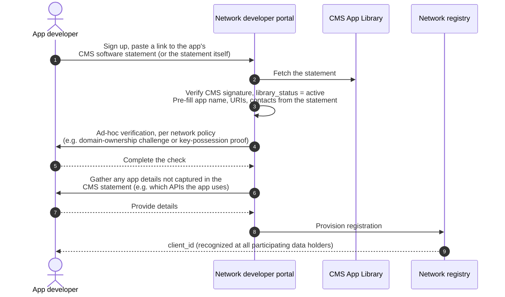
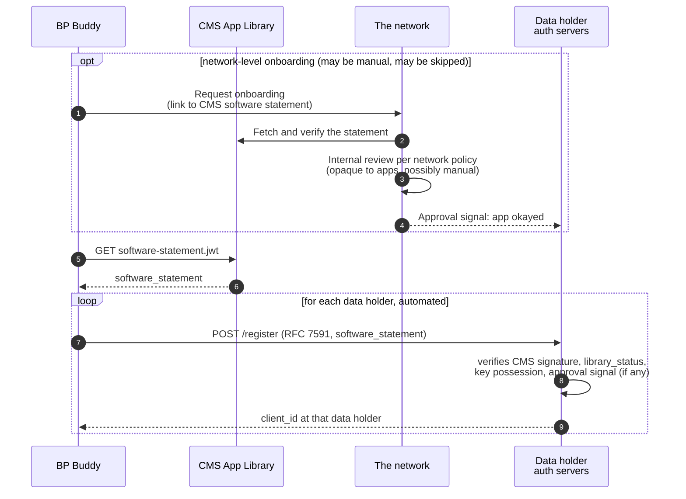
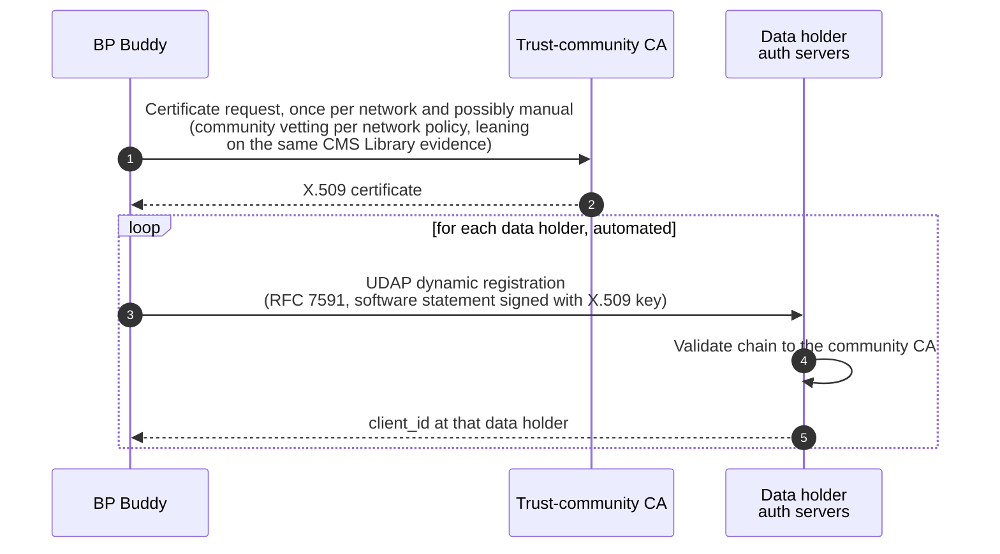
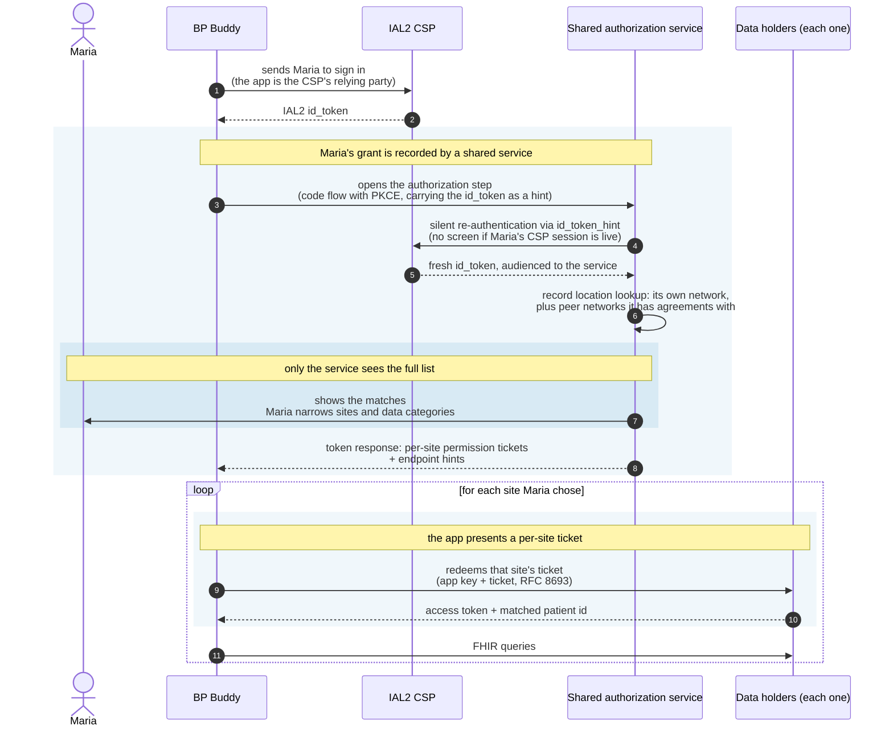
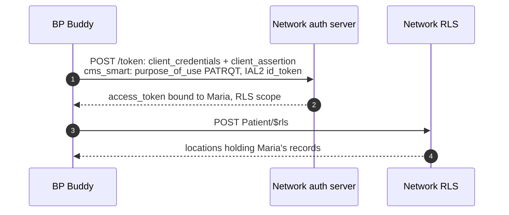
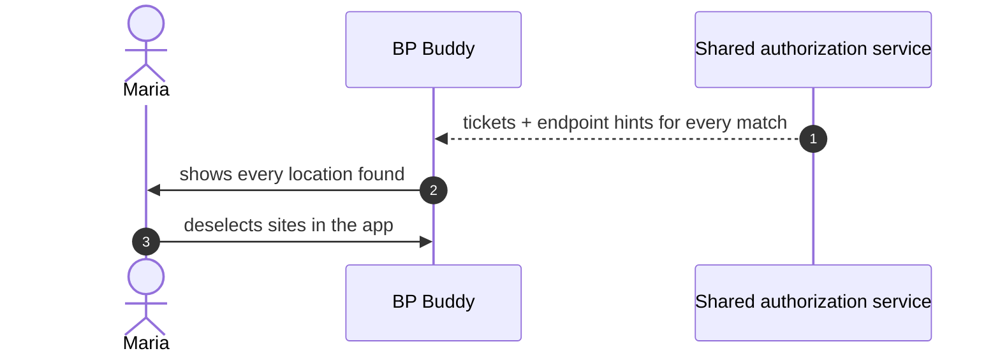
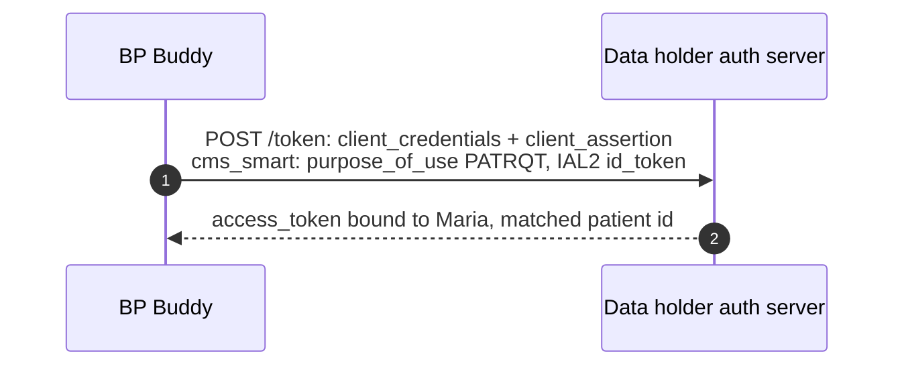

# How Patient Apps Use a CMS-Aligned Network for Record Location and Data Access

*This page shows how a patient-facing app, listed in the Medicare App Library, uses a CMS-Aligned Network to find where a patient's records are and to fetch them. Every flow on it ends the same way: each data holder, knowing the app and its key, knowing the patient at IAL2, and knowing what she authorized, issues its own access token with the matched patient id. What varies is how those facts reach the data holder.*

The page shows one full flow, then three places where a deployment can do things differently. No version requires a home network, and every version keeps token issuance at the data holder.

---

## Cast

| Actor | Role |
|---|---|
| **BP Buddy** | Patient-facing app, listed in the Medicare App Library and registered with the networks it uses (see How the app joins the ecosystem). |
| **Maria** | A patient with records at several organizations, identity-proofed once at an IAL2 CSP. |
| **IAL2 CSP** | CLEAR / ID.me. Proofed Maria once; later sign-ins against that identity are cheap federated authentications, not re-proofing. |
| **CMS App Library** | Lists vetted patient-facing apps and publishes a signed software statement for each. The statement is the app's identity everywhere on this page. |
| **The network** | A CMS-Aligned Network: its participating data holders plus a record location service. |
| **Data holders** | Each runs its own authorization server and FHIR endpoint, and issues its own access tokens. |

---

## What has to happen

Before a data holder releases anything, it has to know the app, know the patient at IAL2, and know what the patient authorized, and someone has to work out where the patient's records are. There are two ways to do the last three steps: with network-based permission tickets (blue) or with app-based client assertions (orange). A deployment can also mix the two, step by step; the table near the end shows the combinations.

The app joins once per network, before any patient is involved; the next section covers how. Everything after that happens per patient.

---

## How the app joins the ecosystem

CMS publishes a signed software statement for every active Library app: a short-lived JWT naming the app, its URIs, and its `jwks_uri`, and asserting its Library status ([example](example-artifacts/phase0-software-statement.md)). The statement pins the app's display name under the CMS signature, and it binds the app's keys by URL rather than by value, so the app rotates keys at its own `jwks_uri` without anyone re-issuing anything.

Nothing on this page puts an intermediary between the app and the parties it talks to. If a deployment ever does, every receiver must learn both identities, the intermediary's and the app's, because the app is what patients recognize and what audit logs name.

Registration is the other half. The app finds each network, its registration method, and its endpoints in the National Provider Directory. Each network documents one method, and any method is workable if it meets two requirements. It has to operate uniformly across that network's data holders, with manual steps acceptable per network but never per data holder. And it must not add to an app's cost of participating in individual access: if the method involves certificates or other credentials, the network sees to it that apps can get them without paying. The first requirement is what makes registration scale. However a network runs its front door, the layer behind it is automatic, so when a network adds a data holder, no app does any new work, and when an app registers, it does a bounded amount of work per network rather than per organization. Registration ends with the app holding a client_id that the network's data holders recognize, and with each of them able to resolve the app's keys from its `jwks_uri`.

Three patterns cover the methods networks are likely to document. They are examples rather than a closed list: a network can document something else, so long as it meets the same two requirements.

### Once per network, through a developer portal

A human registers once for the whole network. The portal pre-fills its form from the CMS statement and verifies one signature instead of re-vetting the app; what its ad-hoc verification looks like is the network's business, and the spec should leave it unspecified. A network can also run this pattern with a different front door, forwarding dynamic registration requests from any of its data holders to the central registry and syncing the resulting client out to the rest. [Example](example-artifacts/phase2a-alpha-portal.md).

### At each data holder, presenting the CMS software statement

The app presents the CMS statement at each data holder's RFC 7591 registration endpoint, and a client library performs the calls in a loop, so the larger count costs nothing manual. The network may run its own onboarding first, with as much manual review as its policy requires, or skip that layer and let the CMS statement carry the decision; its data holders consult the approval signal automatically. The statement pins the app's display name and URIs under the CMS signature, which closes a gap seen in certificate schemes where any credentialed app can register under any name it likes. [Example](example-artifacts/phase2b-beta-dynreg.md).

### At each data holder, presenting a community-issued certificate

The network's community CA issues the app a certificate, with vetting per the network's policy that can lean on the same CMS Library evidence, and UDAP dynamic registration proceeds at each data holder from there. Certificate processes are where costs most often creep in, so the second requirement above bears repeating: a network that chooses a CA-based flow makes sure that getting certificates adds nothing to an app's cost of participating in individual access. Issued certificates have to track the app's `jwks_uri` automatically (see Keys over time below). [Example](example-artifacts/phase2c-gamma-udap.md).

---

## The permission-ticket flow, step by step

This expands the blue path from the figure. A shared authorization service captures the grant: a party trusted by the network to do so, though not necessarily operated by it. It may be the network's own service, a portal vendor, or another party the network's data holders recognize, and it can run record location lookups against its own network and against peer networks it has agreements with. The app then redeems per-site tickets at the data holders:

The blue bands carry the same labels as the blue path in the figure; each is a choice point, and the sections after this walkthrough show the alternative at each. Walking it through:

1. BP Buddy signs Maria in at her IAL2 CSP itself: the app is the CSP's relying party and bears the proofing relationship. (The proofing cost was paid once; later sign-ins against that identity are cheap federated authentications.) [Example](example-artifacts/csp-sign-in.md).
2. The app opens the authorization step at the shared authorization service (a standard SMART App Launch code flow with PKCE), already holding Maria's id_token, which it passes as a hint. The request also carries the app's Library-backed identity, so the service knows exactly which app is asking without any prior relationship. [Example](example-artifacts/authorization-step.md).
3. The service re-authenticates Maria silently against the CSP using the hint: no screen if her CSP session is live, no re-proofing ever, and the service receives a fresh id_token audienced to itself. (Whether ecosystem re-authentication is priced at zero is a CSP participation-terms question worth exploring, not an architecture question.)
4. The service looks up where Maria has records: its own network's data holders, plus peer networks it has agreements with. The patient-facing screen is the right place for this lookup to live, because whoever presents the choices needs to know what the choices are. [Example](example-artifacts/peer-record-location.md).
5. Maria sees the matches and narrows them: which sites, which data categories. Sites she leaves out are never disclosed to the app, either as hints or as tickets.
6. The token response back to the app carries one signed permission ticket per chosen site plus endpoint hints ([SMART Permission Tickets, proposal 003](https://build.fhir.org/ig/jmandel/smart-permission-tickets-wip/proposal-003-smart-launch-issuance.html); [example response](example-artifacts/issuance-token-response.md)). Each ticket binds the grant: Maria's demographics, her identity evidence, the authorized scope, the site it is for, and the app's key.
7. At each data holder, the app presents its key and that site's ticket (RFC 8693 token exchange). The data holder verifies the ticket signature, independently verifies the identity evidence inside it, runs its own patient match, applies its own policy, and issues its own access token with the matched patient id ([example ticket](example-artifacts/permission-ticket.md)).
8. FHIR queries proceed with each data holder's token. A still-valid ticket can be re-presented for a fresh token; expired tickets are renewed at the service with a refresh token, without re-running the authorization step ([example](example-artifacts/issuance-token-response.md)).

There is no `$rls` call by the app anywhere in this story: record location happened inside the authorization step, and the app received its answer as tickets.

---

## Choice point: who records the grant

The permission-ticket flow establishes the grant at the shared authorization service. The alternative is the flow CMS documents for Blue Button, where the app attests the grant itself:

`cms_smart` is the extension CMS documents for [Blue Button's CMS Aligned Networks flow](https://bluebutton.cms.gov/cms-aligned-networks-documentation/): a `client_credentials` grant whose signed `client_assertion` carries a `purpose_of_use` (`PATRQT` for patient access) and the patient's IAL2 id_token ([example](example-artifacts/phase3-rls.md)). `$rls` stands in for a record location operation whose wire shape is still an open question. Here "what Maria authorized" rests on the app's own assertion, backed by Library vetting, and Maria never leaves the app. This is the shape worked through end to end in the [connectivity walkthrough](app-connectivity-flows.md), and it is the floor the ecosystem already documents. Choosing it constrains the other two choice points: with no authorization step there is no service-side screen, so narrowing moves into the app, and there are no tickets, so the token request becomes `cms_smart`.

## Choice point: where Maria narrows sites

In the permission-ticket flow, Maria narrows sites on the service's screen, before the app learns anything. The alternative sends the app everything ([example](example-artifacts/blanket-ticket.md)) and lets her narrow the list inside the app:

Maria has the same control over what data flows either way. The difference is what the app learns: with in-app selection the app has already seen every care relationship (the behavioral health clinic, the reproductive health clinic) before Maria chooses. No in-app control can undo that disclosure. Service-side selection is the only placement where "the app never learns I was ever there" is achievable.

## Choice point: what the app presents at each data holder

In the permission-ticket flow the app presents that site's ticket. The alternative uses the same `cms_smart` call described under the grant choice point ([example](example-artifacts/phase4b-federated.md)):

The data holder's verification work is nearly identical either way: client key against the Library-verified `jwks_uri`, identity evidence, its own patient match. What shifts is the attestation of scope: a ticket carries what an independent party recorded Maria authorizing; the `cms_smart` call carries what the app asserts she authorized. Notably, a deployment can adopt the authorization step while its data holders keep accepting `cms_smart` unchanged; the service's record of the grant exists even where it is not yet presented, which makes this the natural migration column in the table below.

## How Maria signs in (within the grant step)

In the permission-ticket flow, the app signed Maria in at the CSP and the service re-authenticates her silently with an `id_token_hint`, which yields a fresh, service-audienced assertion that the person in this browser is Maria. The lighter option skips the re-authentication: the service accepts the app-passed IAL2 id_token itself as the sign-in. That token is automatically verifiable and audience-bound to the app, and accepting it is the same trust model the `cms_smart` flow already runs on. It is an honest option provided it is named for what it is: it proves the app holds a recent assertion about Maria, not that Maria is present in this browser. A service accepting it should say so rather than implying a separation it does not deliver.

---

## The combinations side by side

| | Choices | Who attests what Maria authorized | Who learns the full site list | Maria's steps | Data holder verifies |
|---|---|---|---|---|---|
| **Service-captured grant, tickets at data holders** | grant locations token | shared authorization service, in a signed ticket | the service only; the app learns chosen sites | one redirect: sign-in (often silent) + one screen | ticket + evidence + own match |
| **Service-captured grant, `cms_smart` at data holders** | grant locations token | the service (recorded), app (presented) | the service only | same as the first row | `cms_smart` call, unchanged |
| **Service-captured grant, site selection in the app** | grant locations token | shared authorization service | the app | one redirect, selection in app | ticket + evidence + own match |
| **App-asserted grant (`client_credentials` + `$rls`)** | grant locations token | the app, backed by Library vetting | the app | none beyond CSP sign-in | `cms_smart` call |

One dependency: if the grant is app-asserted, then site narrowing happens in the app and data holders see `cms_smart`, because without the authorization step there is no service screen and no tickets. The rest combine freely.

---

## What the authorization step adds

- **Site-relationship privacy.** The existence of a care relationship is disclosed only as far as Maria chooses, which only service-side selection can deliver.
- **Single-place revocation.** Maria revokes the grant where she made it, and the revocation reaches every credential derived from it, instead of hunting through per-app and per-portal switches.
- **An audit story that names the app.** The ticket records which app Maria authorized; that is what data holders log and what she will recognize later.
- **Incremental federation.** A service that shows its own network's matches can add peer networks as agreements form. The patient's stops shrink from many toward one, with no flag day.

## Keys over time

The app's keys live at its `jwks_uri` and rotate there on the app's own schedule. The CMS statement binds the URL, not a key, so rotation needs no re-issuance anywhere ([example](example-artifacts/phase5-key-rotation.md)). Any credential a network or a trust community issues to the app has to track the `jwks_uri` automatically; if re-syncing means emailing someone, rotation has turned into a manual per-network step.

---

*Design context.* When a shared authorization service is in the path, several parties are distinct: the CSP that proofs identity, the service that captures authorization, the app that receives data. That distinctness has consequences: the party attesting the grant has no financial stake in the data flowing. CMS's own position that a CSP should not learn sites of care leans the same way. But none of these flows mandates the separation, and the table's rightmost rows collapse the parties deliberately. The table is the honest accounting; deployments choose their row.
