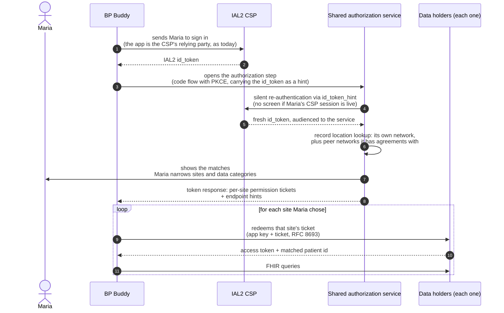
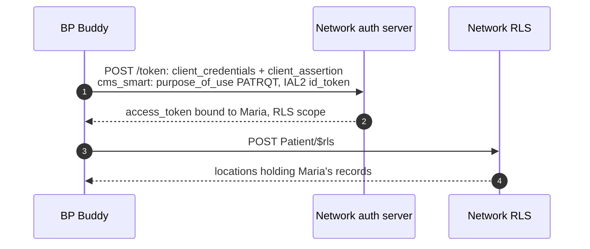
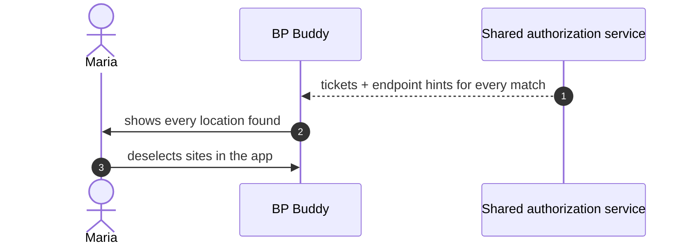
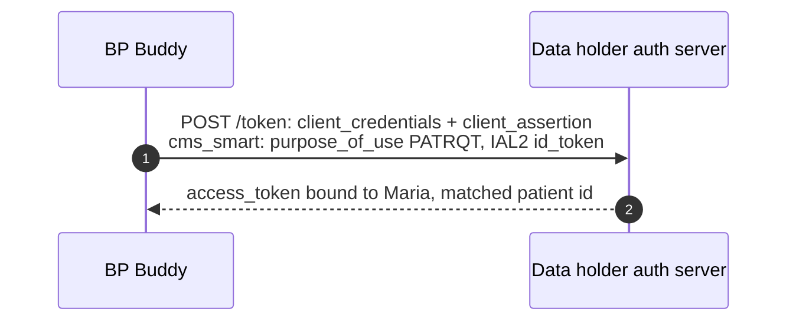

# How a Patient's Authorization Reaches the RLS and Data Holders

*Companion to [app-connectivity-flows.md](app-connectivity-flows.md), which covers registration and connectivity end to end using the CMS-documented `cms_smart` token shape. This page answers the narrower question the working group asked: how does a patient's authorization get established, and how does it reach the record locator service and each data holder? Every path below satisfies the same token-step contract stated in that walkthrough's Conventions — the data holder ends up knowing the client and its key, the patient at IAL2, and what the patient authorized, and it returns its own access token plus the matched patient id. What varies is how those facts arrive.*

The page shows one full flow, then three places where a deployment can do things differently. No version requires a home network, and every version keeps token issuance at the data holder.

---

## Cast

| Actor | Role |
|---|---|
| **BP Buddy** | Patient-facing app from the [connectivity walkthrough](app-connectivity-flows.md), listed in the Medicare App Library, registered with the networks it uses. |
| **Maria** | A patient with records at several organizations, identity-proofed once at an IAL2 CSP. |
| **IAL2 CSP** | CLEAR / ID.me. Proofed Maria once; later sign-ins against that identity are cheap federated authentications, not re-proofing. |
| **Shared authorization service** | The party whose screen captures what Maria authorizes. Trusted by a network — though not necessarily operated by one; it may be a network's own service, a portal vendor, or another party the network's data holders recognize. It can run record location lookups against its own network and against peer networks it has agreements with. |
| **Data holders** | Each runs its own authorization server and FHIR endpoint, and issues its own access tokens. |

---

## What has to happen

Before a data holder releases anything, it has to know the app, know Maria at IAL2, and know what she authorized — and someone has to work out where her records are. The numbered circles mark the three places where there is more than one reasonable way to do this:

## The core story, step by step

This is the blue path through the diagram. A shared authorization service sits between the app and the data holders:

Walking it through:

1. BP Buddy signs Maria in at her IAL2 CSP itself, exactly as it does today: the app is the CSP's relying party and bears the proofing relationship. (The proofing cost was paid once; later sign-ins against that identity are cheap federated authentications.)
2. The app opens the authorization step at the shared authorization service — a standard SMART App Launch code flow with PKCE — already holding Maria's id_token, which it passes as a hint. The request also carries the app's Library-backed identity, so the service knows exactly which app is asking without any prior relationship.
3. The service re-authenticates Maria silently against the CSP using the hint: no screen if her CSP session is live, no re-proofing ever, and the service receives a fresh id_token audienced to itself. (Whether ecosystem re-authentication is priced at zero is a CSP participation-terms question worth exploring, not an architecture question.)
4. The service looks up where Maria has records: its own network's data holders, plus peer networks it has agreements with. The patient-facing screen is the right place for this lookup to live, because whoever presents the choices needs to know what the choices are.
5. Maria sees the matches and narrows them: which sites, which data categories. Sites she leaves out are never disclosed to the app — not as hints, not as tickets.
6. The token response back to the app carries one signed permission ticket per chosen site plus endpoint hints ([SMART Permission Tickets, proposal 003](https://build.fhir.org/ig/jmandel/smart-permission-tickets-wip/proposal-003-smart-launch-issuance.html); [example response](example-artifacts/issuance-token-response.md)). Each ticket binds the grant: Maria's demographics, her identity evidence, the authorized scope, the site it is for, and the app's key.
7. At each data holder, the app presents its key and that site's ticket (RFC 8693 token exchange). The data holder verifies the ticket signature, independently verifies the identity evidence inside it, runs its own patient match, applies its own policy, and issues its own access token with the matched patient id ([example ticket](example-artifacts/permission-ticket.md)).
8. FHIR queries proceed with each data holder's token. A still-valid ticket can be re-presented for a fresh token; expired tickets are renewed at the service with a refresh token, without re-running the authorization step.

There is no `$rls` call by the app anywhere in this story: record location happened inside the authorization step, and the app received its answer as tickets.

---

## Choice point ① — where the grant is established

The core story establishes the grant at the shared authorization service. The orange choice is the flow CMS documents today, where the app attests the grant itself:

Here "what Maria authorized" rests on the app's own assertion, backed by Library vetting, and Maria never leaves the app. This is the shape worked through end to end in the [connectivity walkthrough](app-connectivity-flows.md), and it is the floor the ecosystem already documents. Choosing it constrains the other two choice points: with no authorization step there is no service-side screen (② moves into the app) and no tickets (③ becomes `cms_smart`).

## Choice point ② — where Maria narrows sites

In the core story Maria narrows sites on the service's screen, before the app learns anything. The orange choice sends the app everything and lets her narrow the list inside the app:

Maria has the same control over what data flows either way. The difference is what the app learns: with in-app selection the app has already seen every care relationship — the behavioral health clinic, the reproductive health clinic — before Maria chooses. No in-app control can undo that disclosure. Service-side selection is the only placement where "the app never learns I was ever there" is achievable.

## Choice point ③ — what the app presents at each data holder

In the core story the app presents a ticket. The orange choice uses the same `cms_smart` call the walkthrough documents:

The data holder's verification work is nearly identical either way — client key against the Library-verified `jwks_uri`, identity evidence, its own patient match. What shifts is the attestation of scope: a ticket carries what an independent party recorded Maria authorizing; the `cms_smart` call carries what the app asserts she authorized. Notably, a deployment can adopt the authorization step (①) while its data holders keep accepting `cms_smart` unchanged — the service's record of the grant exists even where it is not yet presented — which makes this the natural migration column in the table below.

## How Maria signs in (within ①)

In the core story the app signed Maria in at the CSP and the service re-authenticates her silently with an `id_token_hint`, which yields a fresh, service-audienced assertion that the person in this browser is Maria. The lighter option skips the re-authentication: the service accepts the app-passed IAL2 id_token itself as the sign-in. That token is automatically verifiable and audience-bound to the app, and accepting it is the same trust model the `cms_smart` flow already runs on — so it is an honest option, provided it is named for what it is: it proves the app holds a recent assertion about Maria, not that Maria is present in this browser. A service accepting it should say so rather than implying a separation it does not deliver.

---

## The combinations side by side

| | Who attests what Maria authorized | Who learns the full site list | Maria's steps | Data holder verifies |
|---|---|---|---|---|
| **Core story** (all blue) | shared authorization service, in a signed ticket | the service only; the app learns chosen sites | one redirect: sign-in (often silent) + one screen | ticket + evidence + own match |
| **Service step, `cms_smart` at data holders** (blue ①②, orange ③) | the service (recorded), app (presented) | the service only | same as core | `cms_smart` call, unchanged from today |
| **In-app selection** (blue ①③, orange ②) | shared authorization service | the app | one redirect, selection in app | ticket + evidence + own match |
| **Today's documented shape** (all orange) | the app, backed by Library vetting | the app | none beyond CSP sign-in | `cms_smart` call |

One dependency: orange at ① forces orange at ② and ③, because without the authorization step there is no service screen and no tickets. The rest combine freely.

---

## What the core story buys

- **Site-relationship privacy.** The existence of a care relationship is disclosed only as far as Maria chooses, which only service-side selection can deliver.
- **Single-place revocation.** Maria revokes the grant where she made it, and the revocation reaches every credential derived from it — instead of hunting through per-app and per-portal switches.
- **An audit story that names the app.** The ticket records which app Maria authorized; that is what data holders log and what she will recognize later.
- **Incremental federation.** A service that today shows its own network's matches can add peer networks as agreements form. The patient's stops shrink from many toward one without any flag-day.

*Design context.* Several parties in the core story happen to be distinct: the CSP that proofs identity, the service that captures authorization, the app that receives data. That distinctness has consequences — the party attesting the grant has no financial stake in the data flowing — and CMS's own position that a CSP should not learn sites of care leans the same way. But none of these flows mandates the separation, and the table's rightmost rows collapse the parties deliberately. The table is the honest accounting; deployments choose their row.
